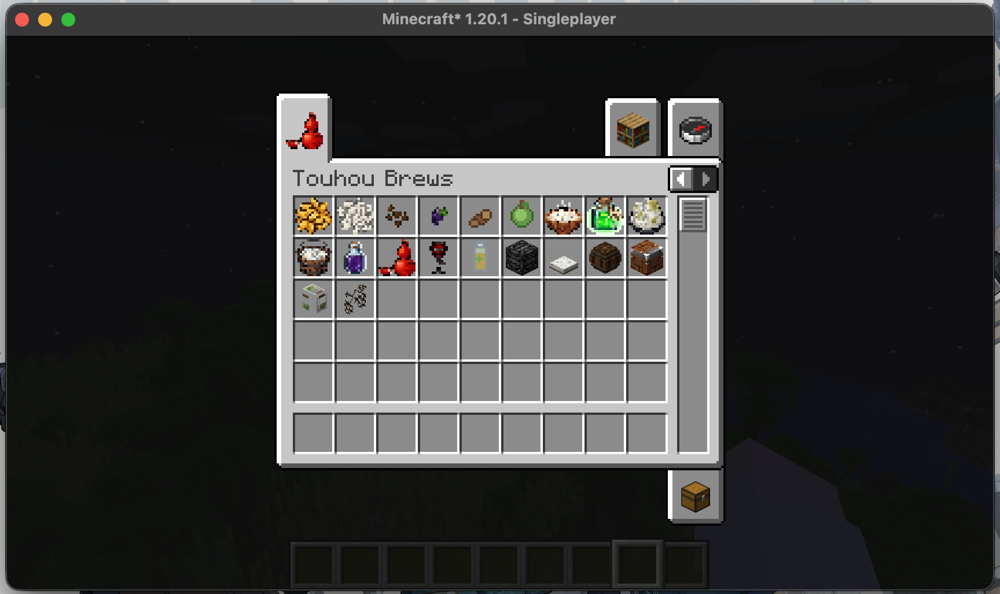

# 东方酒艺 (Touhou Brews)

[English](README.md)

<!-- [Logo Placeholder] -->

这是一个基于东方Project主题的 Minecraft Fabric 1.20.1 酿酒工业模组，专注于拟真的酿造工艺流水线和特色酒类。

### 游戏内效果预览

---

## 酿造工艺系统

本模组采用高度还原现实酿造步骤且具有沉浸式交互的机制。机器现已改为基于 GUI 的容器交互：右键打开机器界面，在槽位中放入原料并通过进度与状态指示观察加工过程。

### 东方清酒线 (Sake Pipeline) - **[已完成]**
经典的“并行复式发酵”工艺，分为四个阶段：
1. **水稻种植**: 种下水稻种子，收获 稻米。
2. **蒸锅**: 底部垫热源（营火/岩浆），打开 GUI 放入稻米，将其蒸熟成为 **蒸米**。(10秒)
3. **培育盘**: 必须放置在亮度≤7的昏暗处。打开 GUI 放入蒸米和米曲霉孢子，培育成 **米曲**。(30秒)
4. **发酵桶**: 打开 GUI 放入 米曲 + 蒸米 + 水瓶，经过混合发酵后产出 **酒醪**。(60秒)
5. **压榨床**: 打开 GUI 放入酒醪，将其压榨成传说中的 **鬼族大吟酿**。(5秒)

*鬼族大吟酿效果：力量 II，抗性提升 I，缓慢与反胃（微醺惩罚）。*

### 西洋果酒线 (Wine Pipeline) - **[已完成]**
无需糖化的直接发酵工艺：
1. **葡萄架**: 类似栅栏可自适应连接搭建藤架。种下葡萄种子，藤蔓会在架子上生长蔓延，无需破坏即可反复采摘 **葡萄**。
2. **压榨床**: 打开 GUI 将葡萄压榨成 **葡萄汁**。(3秒)
3. **发酵桶**: 在 GUI 中放入葡萄汁 + 水瓶直接发酵，得到 **蕾米莉亚的血红葡萄酒**。(45秒)

*血红葡萄酒效果：夜视 II，力量 II，再生 II，短暂反胃。*

### 幽雅梅酒线 (Infusion Pipeline) - **[已完成]**
以基底酒浸泡青梅的配制酒路线：
1. **青梅种植**: 种下青梅种子，收获可用于泡酒的 **青梅**。
2. **基底酒准备**: 先走完清酒线，获得 **鬼族大吟酿** 作为当前版本的基底酒。
3. **泡酒罐**: 打开 GUI 放入 鬼族大吟酿 + 青梅 + 糖，密封静置后产出 **八意永琳的幽雅梅酒**。(60秒)

*幽雅梅酒效果：再生 I、速度 I、急迫 I，并附带极轻微的反胃。*

---

## 开发路线图

- [x] **Phase 1: 核心基础构建** (Fabric Mod 初始化，BlockEntity与Tick同步架构，Mojang映射规范)。
- [x] **Phase 2: 作物系统实装** (8阶段水稻、3阶段龙门架自适应葡萄藤系统完成，支持Loot Tables与Fortune附魔)。
- [x] **Phase 3: 清酒全流水线** (蒸锅、培育盘、发酵桶、压榨床 的方块交互逻辑、粒子特效和多模型状态全部实装并双语本地化)。
- [x] **Phase 4A: 果酒拓展** (复用压榨床和发酵桶，通过多配方支持完成西洋红酒分支)。
- [x] **Phase 4B: 泡酒配制工艺** (已新增青梅作物与泡酒罐，通过鬼族大吟酿作为基底酒浸泡青梅与糖，产出八意永琳的幽雅梅酒)。
- [ ] **Phase 4C: 蒸馏烈酒工艺**: 计划新增蒸馏塔机器，提纯低度酒为高度烈酒基底。
- [ ] **Phase 4D: 醉意系统与传说容器**: 计划引入全局多级醉意Debuff系统，并且实装传说物品（如每次饮用自动恢复的【伊吹瓢】）。

---

## 安装与运行

- **Minecraft Version**: `1.20.1`
- **Mod Loader**: `Fabric 0.15+`
- **Dependencies**: 需要依赖 `Fabric API`。
- 如果想参与开发，克隆仓库后使用 `./gradlew build` 编译（推荐使用 JDK 21）。
